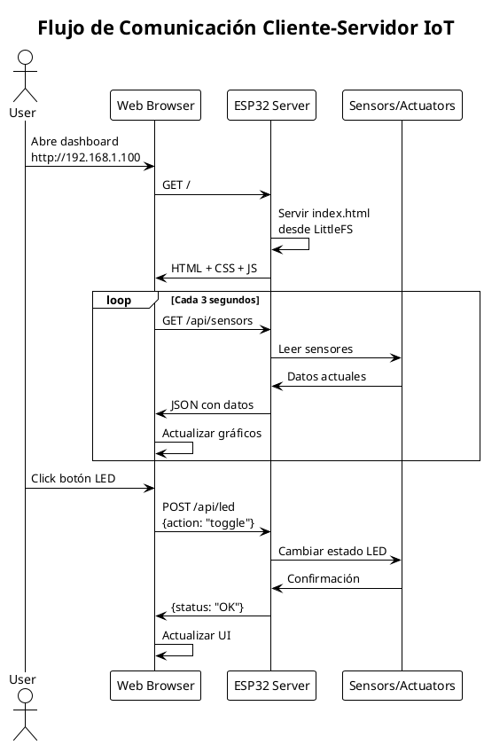

# Clase 4 - Servidor Web IoT

## 📚 Contenido de la Clase

Esta es la cuarta clase del curso **Internet de las Cosas con ESP32** de la Universidad Nacional de Santiago del Estero. Se enfoca en crear sistemas IoT completos con conectividad web, interfaces gráficas y control remoto.

## 🎯 Objetivos de Aprendizaje

Al finalizar esta clase, los estudiantes serán capaces de:
- Conectar el ESP32 a redes WiFi y mantener conexiones estables
- Implementar un servidor web con API REST para comunicación
- Crear interfaces HTML/CSS/JavaScript responsivas y modernas
- Desarrollar sistemas de control remoto para LEDs y actuadores
- Visualizar datos de sensores en tiempo real con actualizaciones automáticas
- Integrar sistemas de archivos LittleFS para servir contenido web

## 📖 Teoría Cubierta

### 1. Conexión WiFi y Configuración
- **Modos de conectividad**: Station (STA) vs Access Point (AP)
- **Gestión de credenciales**: Almacenamiento seguro de SSID/password
- **Reconexión automática**: Manejo de desconexiones y recuperación
- **Estado de conexión**: Monitoreo y diagnóstico de red
- **Direccionamiento IP**: DHCP vs IP estática

### 2. WebServer con API REST
- **Protocolo HTTP**: Métodos GET, POST, PUT, DELETE
- **Rutas estáticas**: Servir archivos HTML, CSS, JS, imágenes
- **API endpoints**: Estructuración de URLs para funcionalidades
- **Formato JSON**: Intercambio de datos estructurados
- **Códigos de respuesta**: 200 OK, 404 Not Found, 500 Error
- **CORS**: Cross-Origin Resource Sharing para desarrollo

### 3. Interfaz HTML Responsive
- **HTML5 semántico**: Estructura moderna y accesible
- **CSS3 avanzado**: Flexbox, Grid, media queries
- **JavaScript moderno**: Fetch API, async/await, DOM manipulation
- **Diseño responsive**: Adaptación a móviles y tablets
- **UX/UI patterns**: Botones, sliders, indicadores de estado

### 4. Control Remoto de LEDs y Sensores
- **PWM remoto**: Control de intensidad desde navegador
- **Estados sincronizados**: Mantener coherencia entre dispositivo y UI
- **Feedback visual**: Indicadores de conexión y estado
- **Comandos asíncronos**: No bloquear la interfaz durante comunicación
- **Validación de datos**: Rangos y tipos correctos

### 5. Actualización Automática de Datos
- **Polling HTTP**: Consultas periódicas al servidor
- **Intervalos optimizados**: Balance entre actualidad y eficiencia
- **Gestión de errores**: Manejo de timeouts y errores de red
- **Cache inteligente**: Evitar actualizaciones innecesarias
- **Indicadores visuales**: Mostrar último update y estado de conexión

## 💻 Proyectos Incluidos

### 4.1 - WiFi Básico
**Ubicación**: `Código/4.1 WiFi Básico/`  
**📄 [Ver README completo](Código/4.1%20WiFi%20Básico/README.md)**

**Descripción**: Conexión básica a red WiFi en modo estación (STA). Muestra información de red, monitorea calidad de señal (RSSI) y reconecta automáticamente si se pierde conexión. Base para todos los proyectos IoT con ESP32.

**Características**:
- Conexión WiFi en modo estación (STA)
- Monitoreo de señal RSSI cada 10s
- Reconexión automática si se desconecta
- Muestra IP, MAC, Gateway cada 30s

**Hardware requerido**:
- Solo WiFi interno del ESP32

**Conceptos aplicados**:
- `WiFi.begin()` y gestión de credenciales
- `WiFi.status()` para monitoreo
- Timers no bloqueantes para reconexión

---

### 4.2 - Servidor Básico
**Ubicación**: `Código/4.2 Servidor Básico/`  
**📄 [Ver README completo](Código/4.2%20Servidor%20Básico/README.md)**

**Descripción**: Servidor HTTP básico que sirve página web desde ESP32. Muestra información del dispositivo y contador de visitas. Fundamento para crear interfaces web e APIs REST.

**Características**:
- Servidor web HTTP en puerto 80
- Página HTML dinámica con datos del ESP32
- Contador de visitas
- Endpoints: / (root) y /about

**Hardware requerido**:
- Solo WiFi interno del ESP32

**Conceptos aplicados**:
- `WebServer` library setup
- Definición de rutas con callbacks
- Headers HTTP y content types
- Generación dinámica de HTML

---

### 4.3 - Control LED Remoto
**Ubicación**: `Código/4.3 Control LED Remoto/`  
**📄 [Ver README completo](Código/4.3%20Control%20LED%20Remoto/README.md)**

**Descripción**: Ejemplo SIMPLE de control remoto de LED vía web usando GET y POST. Interface minimalista con botones para encender/apagar LED y consultar su estado desde navegador.

**Características**:
- Control de LED por HTTP (GET/POST)
- Endpoints: /, /estado, /on, /off
- Interface web con botones
- Respuestas en texto plano y HTML

**Hardware requerido**:
- LED en GPIO 8 (ESP32-C3) / GPIO 2 (otros modelos)

**Conceptos aplicados**:
- Manejo de peticiones GET y POST
- Control de GPIO remoto
- Interface HTML básica con botones
- Sincronización estado físico-virtual

---

### 4.4 - Lectura de Sensores
**Ubicación**: `Código/4.4 Lectura de Sensores/`  
**📄 [Ver README completo](Código/4.4%20Lectura%20de%20Sensores/README.md)**

**Descripción**: Sistema web que muestra lecturas de sensores de temperatura (NTC y DS18B20) a través de peticiones GET. Interface HTML simple para consultar datos en tiempo real desde navegador.

**Características**:
- Doble sensor de temperatura (NTC + DS18B20)
- API REST con endpoints /ntc y /ds18b20
- Página web para visualizar datos
- Control de LED remoto incluido

**Hardware requerido**:
- LED en GPIO 8 (ESP32-C3) / GPIO 2 (otros)
- NTC 10kΩ en GPIO 0 (ESP32-C3) / GPIO 34 (otros) con resistencia de 10kΩ
- DS18B20 en GPIO 3 (ESP32-C3) / GPIO 4 (otros)

**Conceptos aplicados**:
- API REST con múltiples endpoints
- Integración sensores + conectividad
- Respuestas JSON estructuradas
- Actualización asíncrona de datos

---

### 4.5 - Dashboard Completo
**Ubicación**: `Código/4.5 Dashboard Completo/`  
**📄 [Ver README completo](Código/4.5%20Dashboard%20Completo/README.md)**

**Descripción**: Dashboard web profesional con archivos separados (HTML/CSS/JS) servidos desde SPIFFS/LittleFS. Sistema IoT completo con monitoreo de sensores, control de actuadores con PWM, display OLED local e interface responsive moderna.

**Características**:
- Dashboard web con HTML/CSS/JS separados
- Sistema de archivos LittleFS para servir archivos
- Control PWM de LED con brillo ajustable (0-100%)
- Display OLED con temperatura y estado LED
- API REST con endpoints JSON
- Interface responsive moderna

**Hardware requerido**:
- OLED SSD1306 en SDA: GPIO20, SCL: GPIO21
- LED PWM en GPIO 8 (ESP32-C3) / GPIO 2 (otros)

**Conceptos aplicados**:
- Sistema de archivos LittleFS
- Separación de capas (frontend/backend)
- Control PWM remoto
- Dashboard profesional con actualización automática
- Display local + web simultáneos

---

## 💻 Conceptos Técnicos Importantes

### Conectividad WiFi
- **Modo Station (STA)**: ESP32 como cliente que se conecta a router existente
- **SSID y Password**: Credenciales de red WiFi
- **RSSI**: Indicador de intensidad de señal (dBm), valores típicos -30 a -90
- **IP Dinámica**: Asignación automática por DHCP del router
- **Reconexión**: Manejo de pérdidas de conexión con timers no bloqueantes

### Servidor HTTP y API REST
- **Puerto 80**: Puerto estándar para HTTP
- **Métodos HTTP**:
  - GET: Obtener información (idempotente)
  - POST: Enviar datos o comandos
- **Rutas/Endpoints**: URLs que el servidor maneja (/, /api/led, etc.)
- **Content-Type**: Especifica formato de respuesta (text/html, application/json)
- **Códigos de respuesta**: 200 OK, 404 Not Found, 500 Internal Server Error

### Formato JSON para IoT
```json
{
  "sensor": "temperature",
  "value": 25.5,
  "unit": "celsius",
  "timestamp": 123456
}
```
- **Estructura clave-valor**: Fácil de parsear en JS y C++
- **Librería ArduinoJson**: Para serialización y deserialización
- **Ligereza**: Ideal para dispositivos con recursos limitados

### Sistema de Archivos LittleFS
- **Almacenamiento**: Parte de flash memory para archivos
- **Persistencia**: Sobrevive a reinicios
- **Uso**: HTML, CSS, JS, imágenes, configuraciones
- **Upload**: PlatformIO task "Upload Filesystem Image"
- **MIME types**: Asociación automática extensión → content-type

### Control PWM Remoto
- **Resolución**: 8 bits (0-255) típica
- **Frecuencia**: 5 kHz para LEDs (imperceptible al ojo)
- **Duty Cycle**: Porcentaje de tiempo en HIGH
- **Sincronización**: Mantener coherencia entre web y hardware

---

## 🚀 Cómo Ejecutar los Proyectos

### Requisitos Previos
```bash

title Arquitectura Sistema IoT ESP32

package "ESP32 Device" {
    [Sensors] --> [MCU Core]
    [Actuators] <-- [MCU Core]
    [MCU Core] --> [WiFi Module]
    [MCU Core] --> [Web Server]
    [Web Server] --> [LittleFS]
    [Web Server] --> [REST API]
}

package "Network" {
    [WiFi Router]
    [Internet]
}

package "Client Devices" {
    [Web Browser]
    [Mobile App]
    [Other IoT Devices]
}

[WiFi Module] <--> [WiFi Router]
[WiFi Router] <--> [Internet]
[REST API] <--> [Web Browser] : HTTP/JSON
[Web Browser] <--> [Internet]

note right of [REST API]
    GET /api/sensors
    POST /api/actuators
    WebSocket future
end note

@enduml
```

### Flujo de Comunicación Web


## 🛠️ Herramientas y Librerías

### Librerías de ESP32
- **WiFi.h**: Conectividad inalámbrica
- **WebServer.h**: Servidor HTTP básico
- **ArduinoJson.h**: Manejo de JSON
- **LittleFS.h**: Sistema de archivos flash

### Herramientas de Desarrollo Web
- **HTML5**: Estructura semántica moderna
- **CSS3**: Estilos responsive y animaciones
- **JavaScript ES6+**: Funcionalidades modernas
- **Fetch API**: Comunicación asíncrona

### Herramientas de Debugging
- **Serial Monitor**: Logs del servidor
- **Browser DevTools**: Inspector de red y DOM
- **Postman**: Testing de APIs REST
- **PlantUML**: Documentación de arquitectura

## 📚 Recursos de Referencia

### Documentación Oficial
- [ESP32 WiFi Library Reference](https://docs.espressif.com/projects/arduino-esp32/en/latest/api/wifi.html)
- [WebServer Library Documentation](https://github.com/espressif/arduino-esp32/tree/master/libraries/WebServer)
- [LittleFS File System Guide](https://docs.espressif.com/projects/arduino-esp32/en/latest/api/littlefs.html)

### Estándares Web
- [HTTP/1.1 Specification](https://tools.ietf.org/html/rfc2616)
- [REST API Design Best Practices](https://restfulapi.net/)
- [JSON Data Interchange Format](https://www.json.org/)

### Tutoriales Recomendados
- [ESP32 Web Server Tutorial](https://randomnerdtutorials.com/esp32-web-server-arduino-ide/)
- [REST API with ESP32](https://lastminuteengineers.com/esp32-rest-api-web-server/)
- [LittleFS File Upload](https://randomnerdtutorials.com/esp32-web-server-spiffs-spi-flash-file-system/)

## 🔧 Configuración del Entorno

### Librerías Requeridas
```ini
# platformio.ini
[env:esp32dev]
platform = espressif32
board = esp32dev
framework = arduino

lib_deps = 
    bblanchon/ArduinoJson@^6.21.0
    me-no-dev/ESP Async WebServer@^1.2.3
    littlefs
```

### Estructura de Archivos
```
Clase 4/
├── README.md
├── Código/
│   ├── 4.1 WiFi Básico/
│   ├── 4.2 Servidor Básico/
│   ├── 4.3 API Sensores/
│   ├── 4.4 Control LED/
│   ├── 4.5 Dashboard Completo/
│   └── 4.6 Proyecto Final/
└── Docs/
    └── Curso_IoT_ESP32_UNSE_Clase_4.pdf

```

## ✅ Lista de Verificación

Al completar esta clase, verifica que puedes:

- [ ] Conectar ESP32 a WiFi y obtener IP válida
- [ ] Crear servidor web que responda en puerto 80
- [ ] Implementar rutas GET y POST para API REST
- [ ] Servir archivos HTML/CSS/JS desde LittleFS
- [ ] Controlar LEDs remotamente desde navegador
- [ ] Leer sensores y mostrar datos en formato JSON
- [ ] Crear interfaz web responsive que funcione en móvil
- [ ] Implementar actualización automática de datos
- [ ] Manejar errores de conectividad gracefully
- [ ] Documentar APIs y proporcionar ejemplos de uso

## 🚀 Próximos Pasos

La **Clase 5** cubrirá:
- Protocolos IoT avanzados (MQTT, WebSockets)
- Integración con servicios cloud
- Seguridad en dispositivos IoT
- OTA (Over-The-Air) updates
- Optimización de consumo energético

---

**Instructor**: Ing. Fernando Raúl Vera Suasnávar  
**Universidad**: Universidad Nacional de Santiago del Estero  
**Curso**: Internet de las Cosas con ESP32  
**Duración**: 2-3 horas · Semana 4